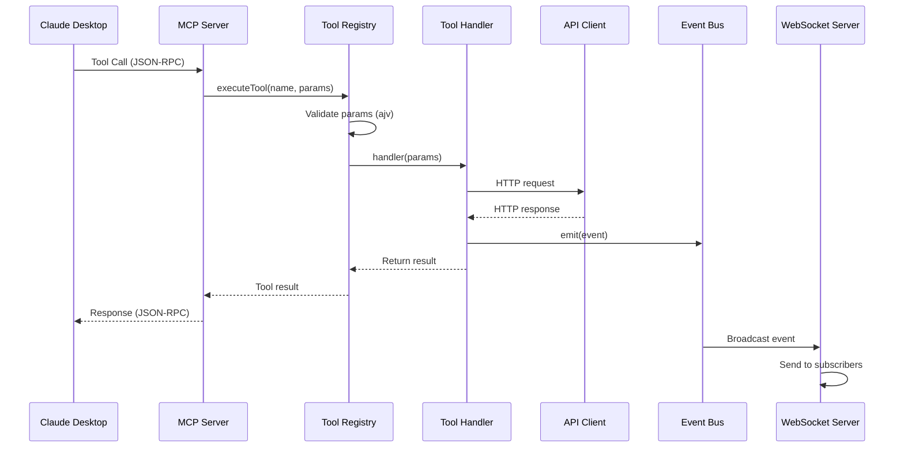

# MCP Development Guide

Developer guide for extending the MCP server with custom tools, understanding the event bus architecture, and testing guidelines.

---

## Table of Contents

1. [Architecture Overview](#architecture-overview)
2. [Adding New Tools](#adding-new-tools)
3. [Event Bus Architecture](#event-bus-architecture)
4. [Testing Guidelines](#testing-guidelines)
5. [Code Style and Best Practices](#code-style-and-best-practices)
6. [Debugging](#debugging)

---

## Architecture Overview

### Component Hierarchy

```
MCP Server (src/server.ts)
├── Tool Registry (src/tools/registry.ts)
│   ├── Tool Definitions (src/tools/*.ts)
│   └── Parameter Validation (ajv)
├── API Client (src/api-client.ts)
│   ├── HTTP Request/Response
│   ├── Error Handling
│   └── Retry Logic
├── Event Bus (src/events/event-bus.ts)
│   ├── Event Emission
│   ├── Subscriber Management
│   └── Event Filtering
└── WebSocket Server (src/events/websocket-server.ts)
    ├── Client Connections
    ├── Authentication
    ├── Event Broadcasting
    └── Replay Support
```

### Data Flow



---

## Adding New Tools

### Step 1: Create Tool File

Create a new file in `src/tools/` following the naming convention `{action}-{resource}.ts`:

```typescript
// src/tools/delete-issue.ts
import { JSONSchemaType } from 'ajv';
import { ToolDefinition, ToolResult } from './registry.js';
import { APIClient, NotFoundError } from '../api-client.js';
import { eventBus } from '../events/event-bus.js';

/**
 * Input parameters for delete_issue tool
 */
export interface DeleteIssueParams {
  /** GitHub Project number */
  projectNumber: number;

  /** GitHub issue number to delete */
  issueNumber: number;
}

/**
 * JSON Schema for delete_issue parameters
 */
const deleteIssueSchema: JSONSchemaType<DeleteIssueParams> = {
  type: 'object',
  properties: {
    projectNumber: {
      type: 'number',
      description: 'GitHub Project number',
    },
    issueNumber: {
      type: 'number',
      description: 'GitHub issue number to delete',
    },
  },
  required: ['projectNumber', 'issueNumber'],
  additionalProperties: false,
};

/**
 * Create delete_issue tool definition
 *
 * This tool removes an issue from a GitHub Project board.
 *
 * @param apiClient - Configured API client instance
 * @returns Tool definition for delete_issue
 */
export function createDeleteIssueTool(
  apiClient: APIClient
): ToolDefinition<DeleteIssueParams> {
  return {
    name: 'delete_issue',
    description:
      'Remove an issue from a GitHub Project board. This operation cannot be undone.',
    inputSchema: deleteIssueSchema,
    handler: async (params: DeleteIssueParams): Promise<ToolResult> => {
      const { projectNumber, issueNumber } = params;

      try {
        // Make DELETE request to API
        await apiClient.delete(
          `/api/projects/${projectNumber}/issues/${issueNumber}`
        );

        // Emit issue.deleted event for WebSocket subscribers
        eventBus.emit('issue.deleted', projectNumber, { issueNumber }, issueNumber);

        // Return success result
        return {
          content: [
            {
              type: 'text',
              text: JSON.stringify(
                {
                  success: true,
                  message: `Issue #${issueNumber} deleted from Project #${projectNumber}`,
                },
                null,
                2
              ),
            },
          ],
        };
      } catch (error) {
        // Handle NotFoundError (404)
        if (error instanceof NotFoundError) {
          return {
            content: [
              {
                type: 'text',
                text: JSON.stringify(
                  {
                    error: `Issue #${issueNumber} not found in Project #${projectNumber}`,
                  },
                  null,
                  2
                ),
              },
            ],
            isError: true,
          };
        }

        // Re-throw other errors to be handled by registry
        throw error;
      }
    },
  };
}
```

### Step 2: Register Tool in Server

Add the tool to `src/server.ts`:

```typescript
// src/server.ts
import { createDeleteIssueTool } from './tools/delete-issue.js';

// In registerTools() method:
private registerTools(): void {
  const apiClient = createAPIClient({
    baseUrl: this.config.apiBaseUrl,
    apiKey: this.config.apiKey,
    timeout: this.config.requestTimeout,
    maxRetries: this.config.retryAttempts,
  });

  // ... existing tool registrations ...

  // Register delete issue tool
  const deleteIssueTool = createDeleteIssueTool(apiClient);
  this.registry.registerTool(deleteIssueTool);
}
```

### Step 3: Add Unit Tests

Create test file `src/tools/delete-issue.test.ts`:

```typescript
import { createDeleteIssueTool } from './delete-issue.js';
import { APIClient } from '../api-client.js';

describe('delete_issue tool', () => {
  let mockApiClient: jest.Mocked<APIClient>;
  let tool: ReturnType<typeof createDeleteIssueTool>;

  beforeEach(() => {
    mockApiClient = {
      delete: jest.fn(),
    } as any;

    tool = createDeleteIssueTool(mockApiClient);
  });

  it('should delete issue successfully', async () => {
    mockApiClient.delete.mockResolvedValue(undefined);

    const result = await tool.handler({
      projectNumber: 70,
      issueNumber: 42,
    });

    expect(mockApiClient.delete).toHaveBeenCalledWith(
      '/api/projects/70/issues/42'
    );
    expect(result.isError).toBeUndefined();
  });

  it('should handle issue not found', async () => {
    mockApiClient.delete.mockRejectedValue(
      new NotFoundError('Issue not found')
    );

    const result = await tool.handler({
      projectNumber: 70,
      issueNumber: 999,
    });

    expect(result.isError).toBe(true);
  });
});
```

### Step 4: Update Documentation

Add tool to API reference documentation (`docs/api-reference.md`).

---

## Tool Development Patterns

### Parameter Validation

Use JSON Schema for strict parameter validation:

```typescript
const schema: JSONSchemaType<Params> = {
  type: 'object',
  properties: {
    // Required string
    title: {
      type: 'string',
      description: 'Issue title',
      minLength: 1,
      maxLength: 256,
    },
    // Optional string
    description: {
      type: 'string',
      description: 'Issue description',
      nullable: true,
    },
    // Enum
    status: {
      type: 'string',
      enum: ['backlog', 'todo', 'in_progress', 'done'],
      description: 'Issue status',
    },
    // Array
    labels: {
      type: 'array',
      items: { type: 'string' },
      description: 'Label names',
      nullable: true,
    },
    // Number with constraints
    priority: {
      type: 'number',
      minimum: 1,
      maximum: 5,
      description: 'Priority (1-5)',
      nullable: true,
    },
  },
  required: ['title', 'status'],
  additionalProperties: false,
};
```

### Error Handling

Follow this error handling pattern:

```typescript
try {
  // Call API
  const result = await apiClient.post('/api/endpoint', data);

  // Emit event if state changed
  eventBus.emit('resource.updated', projectNumber, result);

  // Return success
  return {
    content: [
      {
        type: 'text',
        text: JSON.stringify(result, null, 2),
      },
    ],
  };
} catch (error) {
  // Handle specific errors
  if (error instanceof NotFoundError) {
    return {
      content: [
        {
          type: 'text',
          text: JSON.stringify({ error: 'Resource not found' }, null, 2),
        },
      ],
      isError: true,
    };
  }

  if (error instanceof AuthenticationError) {
    return {
      content: [
        {
          type: 'text',
          text: JSON.stringify({ error: 'Authentication failed' }, null, 2),
        },
      ],
      isError: true,
    };
  }

  // Re-throw unknown errors for registry to handle
  throw error;
}
```

### Event Emission

Emit events for state changes to enable real-time notifications:

```typescript
import { eventBus } from '../events/event-bus.js';

// After successful API call that changes state:
eventBus.emit(
  'issue.created',    // Event type
  projectNumber,       // Project number (required)
  createdIssue,       // Event payload
  issueNumber         // Issue number (optional, for issue events)
);
```

**Event Types**:
- `project.updated`: Project metadata changed
- `issue.created`: New issue created
- `issue.updated`: Issue fields modified
- `issue.deleted`: Issue removed
- `phase.updated`: Phase metadata changed

### Response Formatting

Always return structured JSON responses:

```typescript
// Success response
return {
  content: [
    {
      type: 'text',
      text: JSON.stringify(
        {
          // Response data
          success: true,
          data: result,
        },
        null,
        2  // Pretty-print with 2-space indent
      ),
    },
  ],
};

// Error response
return {
  content: [
    {
      type: 'text',
      text: JSON.stringify(
        {
          error: 'Error message',
          details: 'Additional context',
        },
        null,
        2
      ),
    },
  ],
  isError: true,  // Mark as error
};
```

---

## Event Bus Architecture

### Event Bus Components

The event bus provides in-memory event distribution for real-time notifications.

```typescript
// src/events/event-bus.ts

/**
 * Event types supported by the event bus
 */
export type EventType =
  | 'project.updated'
  | 'issue.created'
  | 'issue.updated'
  | 'issue.deleted'
  | 'phase.updated';

/**
 * State change event structure
 */
export interface StateChangeEvent {
  type: EventType;
  timestamp: string;        // ISO 8601
  projectNumber: number;
  issueNumber?: number;     // Optional, for issue events
  data: unknown;           // Event-specific payload
}
```

### Emitting Events

```typescript
import { eventBus } from '../events/event-bus.js';

// Emit issue created event
eventBus.emit(
  'issue.created',
  projectNumber,
  {
    title: 'New Issue',
    status: 'todo',
    phase: 'Phase 1',
  },
  issueNumber  // Optional issue number
);

// Emit issue updated event
eventBus.emit(
  'issue.updated',
  projectNumber,
  {
    status: 'done',
    previousStatus: 'in_progress',
    updatedFields: ['status'],
  },
  issueNumber
);
```

### Subscribing to Events

```typescript
import { eventBus } from '../events/event-bus.js';

// Subscribe to all events
const subscriberId = eventBus.subscribe(
  (event) => {
    console.log('Event received:', event);
  },
  {}  // No filters
);

// Subscribe to specific project
const projectSubscriberId = eventBus.subscribe(
  (event) => {
    console.log('Project 70 event:', event);
  },
  { projectNumber: 70 }
);

// Subscribe to specific event types
const typeSubscriberId = eventBus.subscribe(
  (event) => {
    console.log('Issue event:', event);
  },
  { eventTypes: ['issue.created', 'issue.updated'] }
);

// Unsubscribe
eventBus.unsubscribe(subscriberId);
```

### Event Filtering

The event bus supports filtering by:
- **Project Number**: Only events for specific project(s)
- **Event Types**: Only specific event types
- **Combined**: Both project and event type filters

```typescript
// WebSocket server subscribes to all events
eventBus.subscribe(
  (event) => {
    // Broadcast to all connected clients
    wsServer.broadcast(event);
  },
  {}  // No filtering
);

// Client-side filtering in WebSocket server
class WebSocketNotificationServer {
  private subscriptions = new Map<string, number[]>();

  subscribe(clientId: string, projectNumbers: number[]) {
    this.subscriptions.set(clientId, projectNumbers);
  }

  broadcast(event: StateChangeEvent) {
    for (const [clientId, projectNumbers] of this.subscriptions) {
      // Filter by client's subscribed projects
      if (projectNumbers.includes(event.projectNumber)) {
        this.sendToClient(clientId, event);
      }
    }
  }
}
```

---

## Testing Guidelines

### Unit Testing Tools

Each tool should have comprehensive unit tests covering:
- Success cases
- Error cases (404, 401, network errors)
- Parameter validation
- Event emission

```typescript
// src/tools/my-tool.test.ts
import { createMyTool } from './my-tool.js';
import { APIClient, NotFoundError } from '../api-client.js';
import { eventBus } from '../events/event-bus.js';

// Mock event bus
jest.mock('../events/event-bus.js', () => ({
  eventBus: {
    emit: jest.fn(),
  },
}));

describe('my_tool', () => {
  let mockApiClient: jest.Mocked<APIClient>;
  let tool: ReturnType<typeof createMyTool>;

  beforeEach(() => {
    // Create mock API client
    mockApiClient = {
      get: jest.fn(),
      post: jest.fn(),
      patch: jest.fn(),
      delete: jest.fn(),
    } as any;

    tool = createMyTool(mockApiClient);

    // Clear event bus mock
    jest.clearAllMocks();
  });

  describe('success cases', () => {
    it('should execute successfully with valid params', async () => {
      const mockResponse = { id: '123', title: 'Test' };
      mockApiClient.post.mockResolvedValue(mockResponse);

      const result = await tool.handler({ param1: 'value1' });

      expect(mockApiClient.post).toHaveBeenCalledWith(
        '/api/endpoint',
        { param1: 'value1' }
      );
      expect(result.isError).toBeUndefined();
      expect(JSON.parse(result.content[0].text)).toEqual(mockResponse);
    });

    it('should emit event on state change', async () => {
      mockApiClient.post.mockResolvedValue({ id: '123' });

      await tool.handler({ projectNumber: 70, param1: 'value1' });

      expect(eventBus.emit).toHaveBeenCalledWith(
        'resource.created',
        70,
        expect.objectContaining({ id: '123' }),
        undefined
      );
    });
  });

  describe('error cases', () => {
    it('should handle not found error', async () => {
      mockApiClient.post.mockRejectedValue(
        new NotFoundError('Resource not found')
      );

      const result = await tool.handler({ param1: 'value1' });

      expect(result.isError).toBe(true);
      expect(JSON.parse(result.content[0].text)).toMatchObject({
        error: expect.stringContaining('not found'),
      });
    });

    it('should handle authentication error', async () => {
      mockApiClient.post.mockRejectedValue(
        new AuthenticationError('Invalid API key')
      );

      const result = await tool.handler({ param1: 'value1' });

      expect(result.isError).toBe(true);
      expect(JSON.parse(result.content[0].text)).toMatchObject({
        error: expect.stringContaining('Authentication'),
      });
    });

    it('should handle network errors', async () => {
      mockApiClient.post.mockRejectedValue(
        new Error('ECONNREFUSED')
      );

      const result = await tool.handler({ param1: 'value1' });

      expect(result.isError).toBe(true);
    });
  });

  describe('parameter validation', () => {
    it('should validate required parameters', async () => {
      // Tool registry handles validation, but test schema is correct
      expect(tool.inputSchema.required).toContain('param1');
    });

    it('should validate parameter types', async () => {
      expect(tool.inputSchema.properties.param1.type).toBe('string');
    });
  });
});
```

### Integration Testing

Test complete workflows with real API calls:

```typescript
// test-integration.js
import { createAPIClient } from './src/api-client.js';
import { createReadProjectTool } from './src/tools/read-project.js';

const apiClient = createAPIClient({
  baseUrl: process.env.STATE_TRACKING_API_URL,
  apiKey: process.env.STATE_TRACKING_API_KEY,
  timeout: 10000,
  maxRetries: 3,
});

const readProjectTool = createReadProjectTool(apiClient);

// Test read project
const result = await readProjectTool.handler({ projectNumber: 70 });
console.log('Project:', JSON.parse(result.content[0].text));
```

### Testing Event Bus

```typescript
// src/events/event-bus.test.ts
import { EventBus } from './event-bus.js';

describe('EventBus', () => {
  let eventBus: EventBus;

  beforeEach(() => {
    eventBus = new EventBus();
  });

  it('should emit and receive events', () => {
    const handler = jest.fn();
    const subscriberId = eventBus.subscribe(handler, {});

    eventBus.emit('issue.created', 70, { title: 'Test' }, 42);

    expect(handler).toHaveBeenCalledWith(
      expect.objectContaining({
        type: 'issue.created',
        projectNumber: 70,
        issueNumber: 42,
        data: { title: 'Test' },
      })
    );

    eventBus.unsubscribe(subscriberId);
  });

  it('should filter by project number', () => {
    const handler = jest.fn();
    eventBus.subscribe(handler, { projectNumber: 70 });

    // Should receive
    eventBus.emit('issue.created', 70, {}, 1);
    expect(handler).toHaveBeenCalledTimes(1);

    // Should not receive
    eventBus.emit('issue.created', 71, {}, 2);
    expect(handler).toHaveBeenCalledTimes(1);
  });

  it('should filter by event type', () => {
    const handler = jest.fn();
    eventBus.subscribe(handler, { eventTypes: ['issue.created'] });

    // Should receive
    eventBus.emit('issue.created', 70, {}, 1);
    expect(handler).toHaveBeenCalledTimes(1);

    // Should not receive
    eventBus.emit('issue.updated', 70, {}, 1);
    expect(handler).toHaveBeenCalledTimes(1);
  });
});
```

### Running Tests

```bash
# Run all tests
pnpm test

# Run specific test file
pnpm test src/tools/my-tool.test.ts

# Watch mode (auto-rerun on changes)
pnpm test:watch

# Coverage report
pnpm test:coverage
```

---

## Code Style and Best Practices

### TypeScript Style

- **Use strict types**: Avoid `any`, prefer specific interfaces
- **Document interfaces**: Add JSDoc comments for exported types
- **Prefer interfaces over types**: For object shapes
- **Use const assertions**: For literal types
- **Enable strict mode**: In `tsconfig.json`

```typescript
// Good
interface Params {
  /** GitHub Project number */
  projectNumber: number;
  /** Issue title */
  title: string;
}

// Bad
type Params = {
  projectNumber: any;
  title: string;
};
```

### Naming Conventions

- **Files**: kebab-case (e.g., `create-issue.ts`)
- **Functions**: camelCase (e.g., `createTool()`)
- **Interfaces**: PascalCase (e.g., `ToolDefinition`)
- **Constants**: UPPER_SNAKE_CASE (e.g., `MAX_RETRIES`)
- **Tool names**: snake_case (e.g., `read_project`)

### Error Handling

- **Catch specific errors**: Use `instanceof` checks
- **Provide context**: Include relevant IDs in error messages
- **Don't swallow errors**: Re-throw unknown errors
- **Use structured errors**: Return JSON with `error` field

```typescript
try {
  const result = await apiClient.get(`/api/projects/${projectNumber}`);
  return { content: [{ type: 'text', text: JSON.stringify(result) }] };
} catch (error) {
  if (error instanceof NotFoundError) {
    return {
      content: [{
        type: 'text',
        text: JSON.stringify({
          error: `Project #${projectNumber} not found`
        })
      }],
      isError: true,
    };
  }
  throw error;  // Let registry handle unknown errors
}
```

### Documentation

- **Tool descriptions**: Clear, concise purpose statement
- **Parameter descriptions**: What the parameter represents
- **Response examples**: Show both success and error cases
- **JSDoc comments**: For all exported functions and interfaces

```typescript
/**
 * Create read_project tool definition
 *
 * This tool fetches complete project details from the api,
 * including project metadata, field definitions, phases, and summary statistics.
 *
 * @param apiClient - Configured API client instance
 * @returns Tool definition for read_project
 *
 * @example
 * const tool = createReadProjectTool(apiClient);
 * const result = await tool.handler({ projectNumber: 70 });
 */
export function createReadProjectTool(
  apiClient: APIClient
): ToolDefinition<ReadProjectParams> {
  // ...
}
```

---

## Debugging

### Enable Debug Logging

```bash
# .env
LOG_LEVEL=debug
```

This enables verbose logging for:
- Tool registration
- Tool execution (with sanitized parameters)
- API requests and responses
- Event emissions
- WebSocket connections and messages

### Inspect MCP Communication

View MCP protocol messages in Claude Desktop logs:

**macOS**:
```bash
tail -f ~/Library/Logs/Claude/mcp*.log
```

**Windows**:
```
%APPDATA%\Claude\Logs\mcp*.log
```

### Debug Tool Execution

Add console.error statements (outputs to Claude Desktop logs):

```typescript
handler: async (params: Params): Promise<ToolResult> => {
  console.error('[DEBUG] Tool called with params:', JSON.stringify(params));

  try {
    const result = await apiClient.post('/api/endpoint', params);
    console.error('[DEBUG] API response:', JSON.stringify(result));

    return { content: [{ type: 'text', text: JSON.stringify(result) }] };
  } catch (error) {
    console.error('[DEBUG] Error:', error);
    throw error;
  }
}
```

### Test Tools Standalone

Test tools outside MCP server context:

```typescript
// scripts/test-my-tool.ts
import { createAPIClient } from '../src/api-client.js';
import { createMyTool } from '../src/tools/my-tool.js';
import { config } from 'dotenv';

config();

const apiClient = createAPIClient({
  baseUrl: process.env.STATE_TRACKING_API_URL!,
  apiKey: process.env.STATE_TRACKING_API_KEY!,
  timeout: 10000,
  maxRetries: 3,
});

const tool = createMyTool(apiClient);

async function test() {
  try {
    const result = await tool.handler({ param1: 'value1' });
    console.log('Success:', JSON.parse(result.content[0].text));
  } catch (error) {
    console.error('Error:', error);
  }
}

test();
```

Run with:
```bash
npx tsx scripts/test-my-tool.ts
```

### VSCode Debugging

Add launch configuration (`.vscode/launch.json`):

```json
{
  "version": "0.2.0",
  "configurations": [
    {
      "type": "node",
      "request": "launch",
      "name": "Debug MCP Server",
      "program": "${workspaceFolder}/packages/mcp-server/src/index.ts",
      "preLaunchTask": "npm: build",
      "outFiles": ["${workspaceFolder}/packages/mcp-server/dist/**/*.js"],
      "env": {
        "STATE_TRACKING_API_KEY": "your_key_here",
        "WS_API_KEY": "your_ws_key_here",
        "LOG_LEVEL": "debug"
      }
    }
  ]
}
```

---

## Advanced Topics

### Custom API Client Methods

Extend API client for specific use cases:

```typescript
// src/api-client.ts
export class APIClient {
  // ... existing methods ...

  /**
   * Batch update multiple issues
   */
  async batchUpdateIssues(
    projectNumber: number,
    updates: Array<{ issueNumber: number; fields: object }>
  ): Promise<Issue[]> {
    return this.post(`/api/projects/${projectNumber}/issues/batch`, {
      updates,
    });
  }
}
```

### Custom Event Types

Add new event types for custom workflows:

```typescript
// src/events/event-bus.ts
export type EventType =
  | 'project.updated'
  | 'issue.created'
  | 'issue.updated'
  | 'issue.deleted'
  | 'phase.updated'
  | 'workflow.started'    // Custom event
  | 'workflow.completed'; // Custom event
```

### Middleware Pattern

Add middleware for cross-cutting concerns:

```typescript
// src/tools/middleware.ts
type ToolMiddleware = (
  handler: ToolHandler
) => ToolHandler;

const loggingMiddleware: ToolMiddleware = (handler) => {
  return async (params) => {
    console.error('Tool called with:', params);
    const start = Date.now();
    const result = await handler(params);
    console.error(`Tool completed in ${Date.now() - start}ms`);
    return result;
  };
};

const cachingMiddleware: ToolMiddleware = (handler) => {
  const cache = new Map();
  return async (params) => {
    const key = JSON.stringify(params);
    if (cache.has(key)) {
      return cache.get(key);
    }
    const result = await handler(params);
    cache.set(key, result);
    return result;
  };
};

// Apply middleware
const handler = cachingMiddleware(loggingMiddleware(baseHandler));
```

---

## See Also

- [MCP Server README](../packages/mcp-server/README.md) - Server overview and setup
- [API Reference](./api-reference.md) - Complete API documentation
- [Integration Guide](./mcp-integration.md) - Setup walkthrough
- [Model Context Protocol](https://modelcontextprotocol.io/) - Official MCP specification

---

Happy building!
