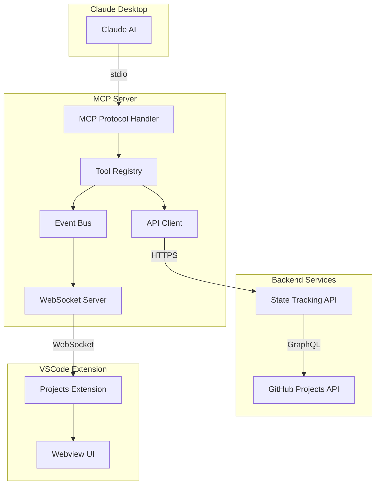

# Stoked Projects MCP Server

Model Context Protocol (MCP) server for seamless integration between Claude Code, the state tracking API, and VSCode extension.

<p align="center">
  <strong>Enable Claude to directly manage GitHub Projects with real-time synchronization</strong>
</p>

---

## Table of Contents

- [Overview](#overview)
- [Features](#features)
- [Installation](#installation)
- [Configuration](#configuration)
- [Usage](#usage)
  - [Claude Desktop Integration](#claude-desktop-integration)
  - [Available Tools](#available-tools)
- [Architecture](#architecture)
- [WebSocket Notifications](#websocket-notifications)
- [Troubleshooting](#troubleshooting)
- [Development](#development)

---

## Overview

The Stoked Projects MCP Server bridges Claude Code with GitHub Projects through a standardized Model Context Protocol interface. It provides:

- **10+ MCP tools** for project and issue management
- **Real-time WebSocket notifications** to VSCode extension
- **Event-driven architecture** with reliable message delivery
- **Type-safe API client** with automatic retries and error handling

This server acts as the command center for Claude-driven project orchestration, enabling AI-assisted workflows that span from project planning through execution.

## Features

### Core Capabilities

- **Project Operations**: Read project metadata, phases, and statistics
- **Issue Management**: Create, read, update, and delete issues with full field support
- **Status Tracking**: Update issue status with automatic GitHub synchronization
- **Phase Management**: Organize issues by project phases
- **Real-time Sync**: WebSocket server broadcasts state changes to connected clients
- **Health Monitoring**: Built-in health checks for API connectivity and authentication

### MCP Protocol Support

- Protocol Version: `2024-11-05`
- Transport: stdio (standard input/output)
- Capabilities: Tools
- Authentication: API key-based

### Reliability Features

- Automatic retry on transient failures (configurable, default: 3 attempts)
- Request timeout protection (configurable, default: 10 seconds)
- Structured error handling with detailed error messages
- Connection pooling for optimal performance

---

## Installation

### Prerequisites

- Node.js 18+ or compatible runtime
- Access to Stoked Projects State Tracking API
- Valid API key for authentication

### Install Dependencies

```bash
cd packages/mcp-server
pnpm install
```

### Build the Server

```bash
pnpm build
```

This compiles TypeScript to JavaScript in the `dist/` directory.

---

## Configuration

### Environment Variables

The server is configured via environment variables. Copy the example file and fill in your values:

```bash
cp .env.example .env
```

#### Required Variables

| Variable | Description | Example |
|----------|-------------|---------|
| `STATE_TRACKING_API_KEY` | Authentication key for the state tracking API | `sk_live_abc123...` |
| `WS_API_KEY` | Authentication key for remote WebSocket clients (not required for localhost) | `ws_abc123...` |

#### Optional Variables

| Variable | Default | Description |
|----------|---------|-------------|
| `STATE_TRACKING_API_URL` | `http://localhost:8167` | Base URL for the API |
| `LOG_LEVEL` | `info` | Logging verbosity: `debug`, `info`, `warn`, `error` |
| `REQUEST_TIMEOUT_MS` | `10000` | Request timeout in milliseconds |
| `RETRY_ATTEMPTS` | `3` | Number of retry attempts for failed requests |
| `WS_PORT` | `8080` | WebSocket server port for notifications |

### Example Configuration

**Development (verbose logging):**
```bash
STATE_TRACKING_API_KEY=sk_dev_your_key_here
WS_API_KEY=ws_dev_your_key_here
LOG_LEVEL=debug
```

**Production (optimized):**
```bash
STATE_TRACKING_API_KEY=sk_live_your_key_here
WS_API_KEY=ws_live_your_key_here
LOG_LEVEL=warn
REQUEST_TIMEOUT_MS=5000
RETRY_ATTEMPTS=2
```

---

## Usage

### Standalone Mode

Run the server directly for testing:

```bash
pnpm start
```

Or use dev mode (rebuild + start):

```bash
pnpm start:dev
```

### Claude Desktop Integration

Add the server to your Claude Desktop configuration file:

**macOS:** `~/Library/Application Support/Claude/claude_desktop_config.json`

**Windows:** `%APPDATA%/Claude/claude_desktop_config.json`

**Linux:** `~/.config/Claude/claude_desktop_config.json`

```json
{
  "mcpServers": {
    "stoked-projects": {
      "command": "node",
      "args": [
        "/absolute/path/to/stoked-projects-project-72/packages/mcp-server/dist/index.js"
      ],
      "env": {
        "STATE_TRACKING_API_KEY": "sk_live_your_key_here",
        "WS_API_KEY": "ws_your_key_here"
      }
    }
  }
}
```

**Important**: Use absolute paths, not relative paths or `~` shortcuts.

### Restart Claude Desktop

After updating the configuration:
1. Quit Claude Desktop completely
2. Relaunch the application
3. Verify the server loaded by checking for available tools

---

## Available Tools

The MCP server provides the following tools for Claude to interact with GitHub Projects:

### 1. health_check

**Description**: Check connectivity and authentication with the state tracking API.

**Parameters**: None

**Example**:
```json
{}
```

**Response**:
```json
{
  "apiAvailable": true,
  "authenticated": true,
  "responseTimeMs": 145,
  "apiVersion": "1.0.0"
}
```

---

### 2. read_project

**Description**: Fetch complete project details including metadata, fields, phases, and statistics.

**Parameters**:
| Name | Type | Required | Description |
|------|------|----------|-------------|
| `projectNumber` | number | Yes | GitHub Project number (e.g., 70) |

**Example**:
```json
{
  "projectNumber": 70
}
```

**Response**:
```json
{
  "projectNumber": 70,
  "id": "PVT_kwDOABCDEF",
  "title": "Project Title",
  "description": "Project description",
  "url": "https://github.com/orgs/example/projects/70",
  "status": "open",
  "public": true,
  "owner": "example-org",
  "fields": [...],
  "phases": [...],
  "stats": {
    "totalItems": 45,
    "openItems": 23,
    "closedItems": 22,
    "totalPhases": 5
  },
  "createdAt": "2024-01-15T10:00:00Z",
  "updatedAt": "2024-01-20T14:30:00Z"
}
```

---

### 3. get_project_phases

**Description**: Get all phases in a project with their order and status.

**Parameters**:
| Name | Type | Required | Description |
|------|------|----------|-------------|
| `projectNumber` | number | Yes | GitHub Project number |

**Example**:
```json
{
  "projectNumber": 70
}
```

**Response**:
```json
{
  "projectNumber": 70,
  "phases": [
    {
      "id": "phase_1",
      "name": "Phase 1: Planning",
      "description": "Initial planning phase",
      "order": 1,
      "status": "completed"
    },
    {
      "id": "phase_2",
      "name": "Phase 2: Development",
      "description": "Core development phase",
      "order": 2,
      "status": "in_progress"
    }
  ],
  "totalPhases": 5
}
```

---

### 4. list_issues

**Description**: List all issues in a project with optional filtering by status, phase, or assignee.

**Parameters**:
| Name | Type | Required | Description |
|------|------|----------|-------------|
| `projectNumber` | number | Yes | GitHub Project number |
| `status` | string | No | Filter by status: `backlog`, `todo`, `in_progress`, `done` |
| `phase` | string | No | Filter by phase name |
| `assignee` | string | No | Filter by GitHub username |

**Example**:
```json
{
  "projectNumber": 70,
  "status": "in_progress",
  "phase": "Phase 2: Development"
}
```

**Response**:
```json
{
  "projectNumber": 70,
  "issues": [
    {
      "number": 42,
      "id": "I_kwDOABCDEF",
      "title": "Implement user authentication",
      "description": "Add OAuth2 authentication flow",
      "status": "in_progress",
      "phase": "Phase 2: Development",
      "assignee": "developer123",
      "labels": ["feature", "backend"],
      "url": "https://github.com/owner/repo/issues/42",
      "createdAt": "2024-01-15T10:00:00Z",
      "updatedAt": "2024-01-20T14:30:00Z"
    }
  ],
  "total": 1,
  "filters": {
    "status": "in_progress",
    "phase": "Phase 2: Development"
  }
}
```

---

### 5. get_issue_details

**Description**: Get detailed information about a specific issue.

**Parameters**:
| Name | Type | Required | Description |
|------|------|----------|-------------|
| `projectNumber` | number | Yes | GitHub Project number |
| `issueNumber` | number | Yes | GitHub issue number |

**Example**:
```json
{
  "projectNumber": 70,
  "issueNumber": 42
}
```

**Response**: Same structure as individual issue in `list_issues`, with full details.

---

### 6. create_issue

**Description**: Create a new GitHub issue and add it to the project board.

**Parameters**:
| Name | Type | Required | Description |
|------|------|----------|-------------|
| `projectNumber` | number | Yes | GitHub Project number |
| `title` | string | Yes | Issue title |
| `body` | string | No | Issue description (markdown) |
| `status` | string | No | Initial status (default: `backlog`) |
| `phase` | string | No | Phase name to assign |
| `assignee` | string | No | GitHub username to assign |
| `labels` | string[] | No | Array of label names |

**Example**:
```json
{
  "projectNumber": 70,
  "title": "Add user profile page",
  "body": "Create a new profile page with user information and settings",
  "status": "todo",
  "phase": "Phase 2: Development",
  "assignee": "developer123",
  "labels": ["feature", "frontend"]
}
```

**Response**:
```json
{
  "number": 43,
  "id": "I_kwDOABCDEF",
  "title": "Add user profile page",
  "description": "Create a new profile page with user information and settings",
  "status": "todo",
  "phase": "Phase 2: Development",
  "assignee": "developer123",
  "labels": ["feature", "frontend"],
  "url": "https://github.com/owner/repo/issues/43",
  "createdAt": "2024-01-20T15:00:00Z",
  "updatedAt": "2024-01-20T15:00:00Z"
}
```

---

### 7. update_issue_status

**Description**: Update the status of an issue on the project board.

**Parameters**:
| Name | Type | Required | Description |
|------|------|----------|-------------|
| `projectNumber` | number | Yes | GitHub Project number |
| `issueNumber` | number | Yes | GitHub issue number |
| `status` | string | Yes | New status: `backlog`, `todo`, `in_progress`, `done` |

**Example**:
```json
{
  "projectNumber": 70,
  "issueNumber": 42,
  "status": "done"
}
```

**Response**: Updated issue object with new status.

---

### 8. update_issue_phase

**Description**: Move an issue to a different project phase.

**Parameters**:
| Name | Type | Required | Description |
|------|------|----------|-------------|
| `projectNumber` | number | Yes | GitHub Project number |
| `issueNumber` | number | Yes | GitHub issue number |
| `phase` | string | Yes | Target phase name |

**Example**:
```json
{
  "projectNumber": 70,
  "issueNumber": 42,
  "phase": "Phase 3: Testing"
}
```

**Response**: Updated issue object with new phase.

---

### 9. update_issue

**Description**: Update multiple fields of an issue simultaneously.

**Parameters**:
| Name | Type | Required | Description |
|------|------|----------|-------------|
| `projectNumber` | number | Yes | GitHub Project number |
| `issueNumber` | number | Yes | GitHub issue number |
| `title` | string | No | New title |
| `body` | string | No | New description |
| `status` | string | No | New status |
| `phase` | string | No | New phase |
| `assignee` | string | No | New assignee (or `null` to unassign) |
| `labels` | string[] | No | New labels array |

**Example**:
```json
{
  "projectNumber": 70,
  "issueNumber": 42,
  "status": "in_progress",
  "assignee": "newdeveloper",
  "labels": ["feature", "backend", "priority-high"]
}
```

**Response**: Updated issue object with all modified fields.

---

## Architecture

### System Overview



### Component Details

#### 1. MCP Protocol Handler (`src/server.ts`)

- Implements MCP protocol version `2024-11-05`
- Handles stdio transport for Claude Desktop communication
- Routes tool calls to appropriate handlers
- Manages server lifecycle (initialization, shutdown)

#### 2. Tool Registry (`src/tools/registry.ts`)

- Centralizes all MCP tool definitions
- Validates input parameters using JSON Schema (ajv)
- Provides error handling wrapper for tool execution
- Sanitizes sensitive data in logs (API keys, tokens)

#### 3. API Client (`src/api-client.ts`)

- Type-safe HTTP client for state tracking API
- Automatic retry with exponential backoff
- Request/response logging with sanitization
- Custom error types: `NotFoundError`, `AuthenticationError`, `ValidationError`

#### 4. Event Bus (`src/events/event-bus.ts`)

- In-memory event distribution system
- Supports event filtering by project number and event type
- Event types: `project.updated`, `issue.created`, `issue.updated`, `issue.deleted`, `phase.updated`
- Designed for 100+ concurrent subscribers

#### 5. WebSocket Server (`src/events/websocket-server.ts`)

- Real-time notification delivery to VSCode extension
- API key authentication via query parameter or header
- Event buffering with replay support (last 100 events)
- Automatic ping/pong keepalive (30-second interval)
- Graceful connection handling with reconnection support

---

## WebSocket Notifications

### Connection Setup

The WebSocket server runs on port `8080` (configurable via `WS_PORT` environment variable) and provides a `/notifications` endpoint.

**Connection URL**: `ws://localhost:8080/notifications`

**Authentication**:

- **Localhost connections (127.0.0.1, ::1, ::ffff:127.0.0.1)**: No authentication required - connections from localhost are automatically trusted
- **Remote connections**: Include API key as query parameter or header:

```
ws://your-server.com:8080/notifications?apiKey=ws_your_key_here
```

Or as WebSocket header:
```javascript
const ws = new WebSocket('ws://your-server.com:8080/notifications', {
  headers: {
    'x-api-key': 'ws_your_key_here'
  }
});
```

**Development Note**: When running the MCP server and VSCode extension on the same machine, no API key configuration is needed. The server automatically allows localhost connections without authentication.

### Message Protocol

#### Client → Server Messages

**Subscribe to Projects**:
```json
{
  "type": "subscribe",
  "projectNumbers": [70, 72, 75]
}
```

**Acknowledge Event Receipt**:
```json
{
  "type": "ack",
  "sequence": 42
}
```

**Replay Missed Events**:
```json
{
  "type": "replay",
  "sinceSequence": 38
}
```

#### Server → Client Messages

**Event Notification**:
```json
{
  "type": "event",
  "sequence": 42,
  "event": {
    "type": "issue.updated",
    "timestamp": "2024-01-20T15:00:00Z",
    "projectNumber": 70,
    "issueNumber": 42,
    "data": {
      "status": "done",
      "previousStatus": "in_progress"
    }
  }
}
```

**Error Message**:
```json
{
  "type": "error",
  "message": "Authentication failed: Invalid API key"
}
```

**Replay Response**:
```json
{
  "type": "replay",
  "events": [
    {
      "sequence": 39,
      "event": { ... }
    },
    {
      "sequence": 40,
      "event": { ... }
    }
  ]
}
```

### Event Types

| Event Type | Description | Data Fields |
|------------|-------------|-------------|
| `project.updated` | Project metadata changed | Updated project fields |
| `issue.created` | New issue added to project | Created issue object |
| `issue.updated` | Issue fields modified | Updated fields, previous values |
| `issue.deleted` | Issue removed from project | Deleted issue number |
| `phase.updated` | Phase metadata changed | Updated phase object |

### Reliability Features

- **Sequence Numbers**: Each event has a unique, incrementing sequence number
- **Event Buffer**: Last 100 events are buffered for replay
- **Acknowledgment**: Clients can acknowledge receipt to track processing
- **Replay**: Clients can request missed events after reconnection
- **Keepalive**: Ping/pong every 30 seconds to detect stale connections

---

## Troubleshooting

### Server Won't Start

**Error**: `Required environment variable STATE_TRACKING_API_KEY not set`

**Solution**: Create `.env` file with valid API key:
```bash
cp .env.example .env
# Edit .env and add your API key
```

---

**Error**: `EADDRINUSE: address already in use :::8080`

**Solution**: WebSocket port is already in use. Change `WS_PORT` in `.env`:
```bash
WS_PORT=8081
```

---

### Authentication Failures

**Error**: `Authentication failed: Invalid or expired API key`

**Cause**: API key is invalid, expired, or missing required permissions.

**Solution**:
1. Verify API key is correct in `.env`
2. Check API key has not expired
3. Confirm API key has necessary permissions (read/write projects)
4. Test with `health_check` tool

---

### Connection Issues

**Error**: `Failed to connect to api`

**Possible Causes**:
- API server is down or unreachable
- Network connectivity issues
- Incorrect `STATE_TRACKING_API_URL` in configuration
- Firewall blocking outbound HTTPS requests

**Diagnosis**:
```bash
# Test API connectivity
curl http://localhost:8167/health

# Check DNS resolution
nslookup localhost:8167

# Test with verbose logging
LOG_LEVEL=debug pnpm start
```

---

### Tool Execution Errors

**Error**: `Project #XX not found`

**Cause**: Project does not exist or API key lacks access.

**Solution**:
1. Verify project number is correct
2. Check project exists in GitHub
3. Confirm API key has access to the project's repository/organization

---

**Error**: `Parameter validation failed`

**Cause**: Tool called with invalid or missing parameters.

**Solution**: Check the parameter requirements in the [Available Tools](#available-tools) section and ensure all required fields are provided with correct types.

---

### WebSocket Connection Issues

**Error**: Extension can't connect to WebSocket server

**Checklist**:
1. Verify MCP server is running (`pnpm start`)
2. Check WebSocket server started (look for log: `WebSocket server listening on port 8080`)
3. Confirm `WS_API_KEY` is set in MCP server `.env`
4. Verify extension has matching API key in VSCode settings
5. Check no firewall blocking localhost connections
6. Try telnet: `telnet localhost 8080`

---

### Debugging Tips

**Enable Debug Logging**:
```bash
LOG_LEVEL=debug pnpm start
```

**Check Server Logs**:
- All logs output to stderr (visible in Claude Desktop logs)
- Timestamps included in ISO 8601 format
- Sensitive data (API keys, tokens) automatically redacted

**Test Individual Tools**:
Use the test scripts to validate specific functionality:
```bash
# Test health check
node scripts/test-health-check.js

# Test integration
node test-integration.js
```

---

## Development

### Project Structure

```
packages/mcp-server/
├── src/
│   ├── index.ts              # Entry point
│   ├── server.ts             # MCP server implementation
│   ├── config.ts             # Configuration and logging
│   ├── api-client.ts         # HTTP client for state API
│   ├── tools/
│   │   ├── registry.ts       # Tool registry and validation
│   │   ├── health-check.ts   # Health check tool
│   │   ├── read-project.ts   # Project read tool
│   │   ├── list-issues.ts    # Issue listing tool
│   │   ├── get-issue-details.ts
│   │   ├── get-project-phases.ts
│   │   ├── create-issue.ts
│   │   ├── update-issue.ts
│   │   ├── update-issue-status.ts
│   │   └── update-issue-phase.ts
│   └── events/
│       ├── event-bus.ts      # Event distribution
│       └── websocket-server.ts # WebSocket notification server
├── dist/                     # Compiled JavaScript (gitignored)
├── .env.example              # Example configuration
├── package.json
├── tsconfig.json
└── README.md
```

### Running Tests

```bash
# Run all tests
pnpm test

# Watch mode (auto-rerun on changes)
pnpm test:watch

# Coverage report
pnpm test:coverage
```

### Adding a New Tool

See the [Developer Guide](../../docs/mcp-development.md) for detailed instructions on adding new MCP tools, including:
- Tool definition structure
- Parameter validation with JSON Schema
- Error handling patterns
- Event emission for real-time notifications
- Testing guidelines

### Code Quality

- **TypeScript**: Strict mode enabled for type safety
- **Linting**: ESLint with TypeScript support
- **Testing**: Jest with comprehensive unit and integration tests
- **Coverage**: 80%+ coverage on core functionality

---

## License

UNLICENSED - Private package for Stoked Consulting

---

## Support

For issues, questions, or feature requests, contact:
- **Project Lead**: Stoked Consulting
- **Documentation**: See [Integration Guide](../../docs/mcp-integration.md)
- **API Reference**: See [API Reference](../../docs/api-reference.md)

---

Built with the [Model Context Protocol](https://modelcontextprotocol.io/) for seamless AI integration.
